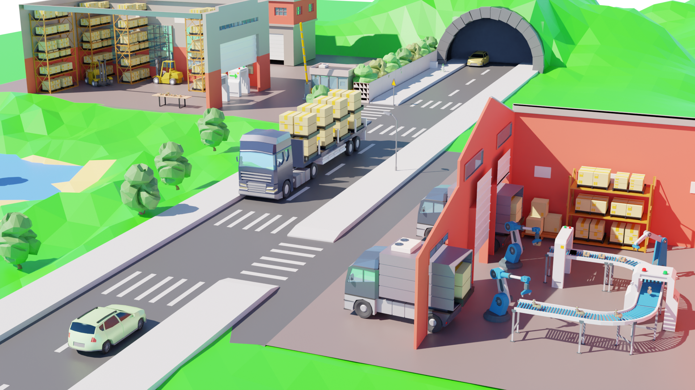
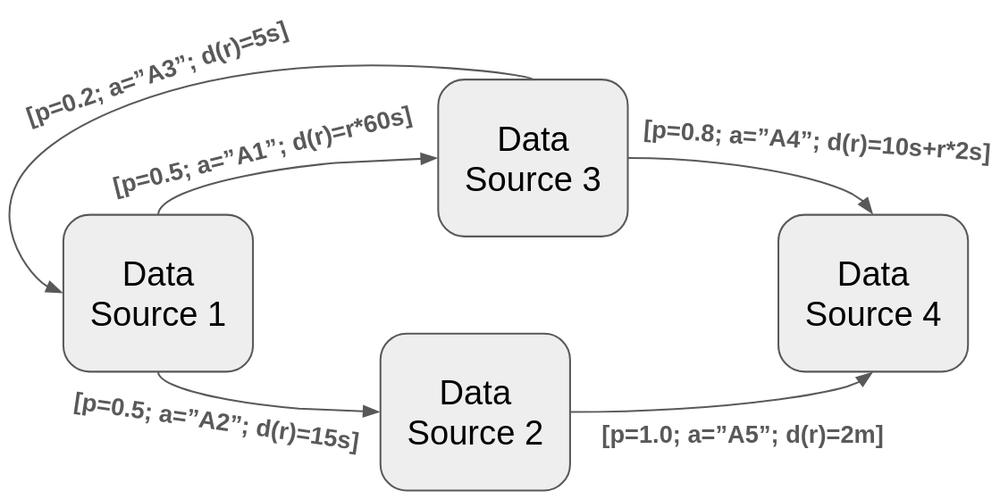

# Distributed Event Factory (DEF)



## About

The Distributed Event Factory (DEF) is a simulation tool for Distributed Process Mining.
It is designed for simulating real world processes utilizing Markov chains.
It produces events consisting of classical process mining measures *caseId*, *activity* and *timestamp* on assembled 
with location data as the *node* and a *group*.
In contrast to traditional process mining, multiple independent event streams are generated instead of a single large
one.

## Who should use the DEF?

DEF mainly targets researchers who like to test and evaluate distributed data mining algorithms.
It is suited for generating data at large scale. So, it can be leveraged for benchmarking and load testing.

## Motivation

The Distributed Event Factory was designed for testing and evaluating Distributed Process Mining Algorithms.
A use case for the tool is the simulation of a smart factory with multiple production facilities.
Each Sensor writes its own event logs. On this data process mining should be applied.
We use such a factory as a running example for configuring the DEF.

## Core concepts

Three core concepts underlie DEF: DataSource, Simulation and Sink. Those entities are configured via yaml-files.

### Datasources
DEF is based on a Markov chain. The vertices of the Markov chain represent the distributed data sources.
The edges represent transitions between the data sources. They contain a probability for transitioning, the activity
performed and a function modelling the process duration.  


A minimal running example yaml is presented here:

```yaml
kind: datasource
name: "MaterialPreparation"
spec:
  name: "MaterialPreparation"
  group: "factory"
  selection: genericProbability
  distribution: [ 0.8, 0.2 ]
  eventData:
    - activity: "Waiting for Material"
      transition: "MaterialPreparation"
      duration: 2
    - activity: "MaterialPreparation - Finished"
      duration: 1
      transition: "AssemblyLineSetup"
```

Every Resource has to specify a kind in our case the kind `datasource`. 
The name (here: `MaterialPreparation`), is used for later referencing this datasource in the code.
The specification `spec` defines the properties of the datasource. The `name` refers to the node name which
is later referred in the `node` field of the generated event. This is also the case for the field `group`. 
Moreover, The `selection` of the next emitted event can be specified. In this case its `genericProbability`. 
It selects the events from the event data by the defined `distribution`. The event data refers to the edges in the Markov
chain including `duration`, `transition` and `activity`.

### Sink

To view and use the data which is generated by the datasources (a) sink(s) must be specified. 
The minimal sink-yaml.  

```yaml
kind: sink
name: console-sink
spec:
  type: console
  id: "Sensor"
  dataSourceRefs:
    - "MaterialPreparation"
```

The `type` of the sink is here defined as `console-sink` which prints the events to the console. The `id` is a prefix to 
identify the sink in the console (especially useful if multiple console sinks are used). The `dataSourceRefs` defines
from which datasource the events are emitted. A datasource can be also linked to multiple sinks.

### Simulation
A `simulation` runs the process through our datasources and emits their events via the sinks. The `type` `stream` creates
a datastream. The `caseId` defines how the case-ids are generated. 
In the `incresing` mode the caseId is an incrementally increased number. The load defines at which speed the simulation is run.
In this case constantly 10 events per second are emitted.

```yaml
kind: simulation
name: streamSimulation
spec:
  type: stream
  caseId: increasing
  load:
    loadBehavior: load
    load: 10
```

### Load Testing
All currently shown configurations are suited for generating mock events streams. 
As additional feature, DEF can also be used for real load testing of process mining applications.
However, therefore specific configurations need to be specified. The type of simulation has to be `laod-test`
and the sinks have to be `loadtest` sinks. The load-test sinks depend on a load-test backend which can precisely emit 
the specified load event at large scale.

The loadtest simulation has 2 new properties to specify: `timeframe` and a load-backend `url`. A timeframe is a batch of events which is submitted together to the load-backend. The number specifies the duration 
of this timeframe in milliseconds.
```yaml
kind: sink
name: http-sink
spec:
  type: http
  id: "Sensor"
  timeframe: 1000
  url: "http://localhost:8080/loadgenerator"
  dataSourceRefs:
    - "MaterialPreparation"
```

The simulation specifies a new property `genTimeframesTilStart` first timeframes can be buffered at the 
load-backend before the actual event emission is started.
```yaml
kind: simulation
name: assembly-line-simulation
spec:
  type: loadTest
  caseId: increasing
  genTimeframesTilStart: 10
  load:
    loadBehavior: constant
    load: 1000
```

### Start the load backend
To use the load-backend [docker](docker.io) needs to be installed on your machine. Currently, 
the load backend only supports writing data to a kafka queue. 
The load-backend is started via the script 
```sh
./run-load-backend <bootstrapServerUrl> <kafkaTopic>
```

## Installation

There are two options install DEF, via PyPI or building it yourself.

### PyPI


### Self Build
Requirements:
- Python >= 3.10

Install dependencies:
```shell
pip install -r requirements.txt
```

### Start the Programm

Define the `Distribted Event Factory` and specify a config file like mentioned above.

```python

from distributed_event_factory.event_factory import EventFactory

event_factory = EventFactory()
(event_factory
 .add_directory("config/datasource/assemblyline")
 .add_file("config/simulation/stream.yaml")
 .add_file("config/sink/sink.yaml")
 ).run()
```

## Advanced configuration
