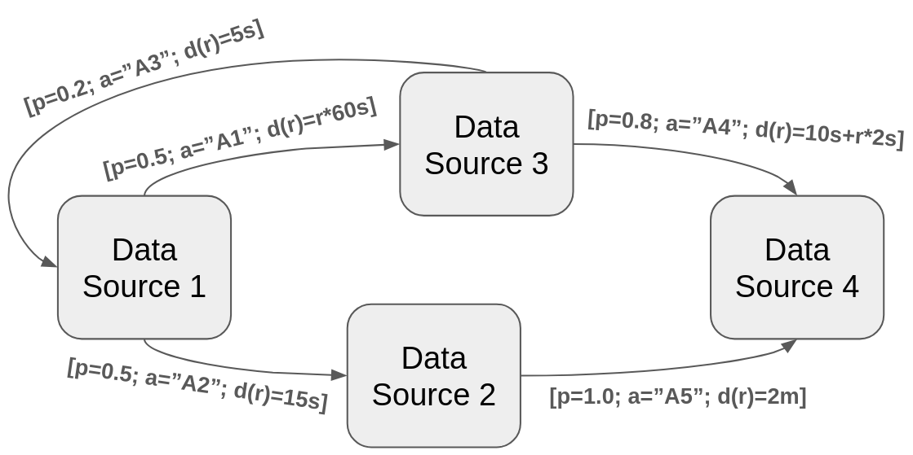

# Distributed Event Factory (DEF)
## About

The Distributed Event Factory (DEF) is a simulation tool for Distributed Process Mining.
It is designed for simulating real world processes utilizing Markov chains.
It produces events consisting of *caseId*, *activity* and *timestamp* on distributed event sources.
In contrast to traditional process mining, multiple independent event streams are generated instead of a single large one.

## Who should use the DEF?
DEF mainly targets researchers who like to test and evaluate distributed data mining algorithms.
It is suited for generating data at large scale. So, it can be leveraged for benchmarking and load testing.

## Motivation

The Distributed Event Factory was designed for testing and evaluating Distributed Process Mining Algorithms.
A use case for the tool is the simulation of a smart factory with multiple production facilities. 
Each Sensor writes its own event logs. On this data process mining should be applied. 
We use such a factory as a running example for configuring the DEF.

## Core concepts
DEF is based on a Markov chain. The vertices of the Markov chain represent the distributed data sources. 
The edges represent transitions between the data sources. They contain a probability for transitioning, the activity performed 
and a function modelling the process duration.  


## Minimal Running Example

The DEF is configured via a yaml file. A minimal running example is presented here
```yaml
type: "load"
numberOfDataSources:
 type: static
 count: 1
caseId: increasing
loadType: constant
load: 20
dataSourceTopology:
  dataSources:
    - name: "Sensor 0"
      sink:
        type: ui
      eventGeneration:
        type: "classic"
        selection: uniform
        from:
          events:
            - duration:
                type: static
                duration: 1
              transition:
                type: next_sensor
                index: 1
              activities:
                selection: uniform
                from:
                  type: list
                  values:
                    - [ "On", "Off" ]
```

The configuration of the DEF can be separated into two parts: 
simulation configuration and the datasource topology.

### Simulation Configuration

`type:` Describes how the simulation is run. Currently, the values `debug` and `load` are supported.
The `load` type gives the possibility to define how the fast the simulation is running. 
The `debug` option should be used for development and produces more verbose stacktraces.

`caseId:` Defines a strategy how the caseIds are generated

`loadType`: Defines the function which describes the load. In this example it is set to a `constant` load function.

`load`: Describes the speed the simulation is running

`numberOfDataSources`: TODO

### Data Source Topology 

The data sources are defined via a Markov chain. The Markov Chain is configured in a distributed fashion.
Each data source knows its successor a

## Features
A main design principle is that every implementation is interchangable by a funciton. In the following all functions
that could be extended are listed and shown how they are configured.

- [Data Sink](provider/sink/README.md)


## Installation
Requirements:
- Python >= 3.10

Install dependencies:  
``
pip install -r requirements.txt 
``